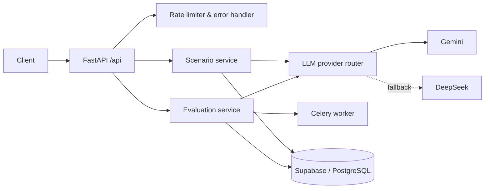

# CareerSim — AI Career Experience Simulator

**Try a career before you commit to it.** CareerSim generates realistic workplace scenarios with an LLM, lets users make decisions as if they were on the job, and evaluates those decisions with a score and personalized feedback.

Built by team **Ascend.AI** as the capstone for the *Building AI-Powered Applications* course at Kutaisi International University (Fall 2025).

---

## The problem

Career decisions are high-stakes but low-feedback. Most students choose a path without ever experiencing the actual work. Internships and job shadowing are limited and hard to access. CareerSim offers a scalable alternative: short, AI-generated simulations of real situations a product manager, software engineer, or tech lead faces day to day.

## How it works

1. The user picks a career (e.g. *Software Engineer*), a difficulty level, and optionally a focus area (e.g. *code review*).
2. The backend prompts an LLM to generate a workplace scenario with multiple response options, returned as **structured JSON**.
3. The user chooses how they would respond.
4. A second LLM call **evaluates the decision** and returns a score, feedback, and an explanation of the trade-offs.

## AI engineering highlights

- **Multi-provider LLM layer** — providers share a common interface; a router tries **Gemini** first and falls back to **DeepSeek** (OpenAI-compatible API) on failure.
- **Error-aware retries** — provider errors are classified: rate limits get exponential backoff (1s → 2s → 4s), invalid requests fail fast, and other errors move to the next provider.
- **Structured outputs** — scenarios and evaluations are generated as JSON and validated with Pydantic before reaching the client.
- **Safety-filter handling** — distinguishes real Gemini safety blocks from false positives (a non-standard finish reason with usable text), so valid generations aren't discarded and true blocks return clear, logged errors.
- **Graceful degradation** — if generation fails, a fallback scenario is served instead of an error.
- **Separate temperatures per task** — higher for creative scenario generation, lower for consistent evaluation.
- **Async evaluation** — evaluations can run as Celery background tasks (returning a task ID) or synchronously.
- **Streaming endpoint** — Server-Sent Events stream the scenario text to the client for progressive display.
- **Production basics** — per-minute and per-hour rate limiting, centralized error handling, input validation, and structured logging.

## Architecture



## Tech stack

| Layer | Technologies |
|---|---|
| Backend | Python, FastAPI, Pydantic, Uvicorn |
| LLMs | Google Gemini (primary), DeepSeek via OpenAI-compatible SDK (fallback) |
| Async & reliability | Celery, Tenacity, Redis (broker) |
| Data & auth | Supabase (PostgreSQL), JWT |
| Frontend | React, TypeScript, Vite |

## API

| Method | Endpoint | Description |
|---|---|---|
| `POST` | `/api/scenarios/generate` | Generate a scenario for a career and difficulty |
| `POST` | `/api/scenarios/generate-stream` | Same, streamed via Server-Sent Events |
| `GET` | `/api/scenarios/career/{career_title}` | List saved scenarios for a career |
| `GET` | `/api/scenarios/{scenario_id}` | Get a scenario by ID |
| `POST` | `/api/scenarios/{scenario_id}/track-view` | Record a scenario view |
| `POST` | `/api/evaluate` | Evaluate a user's answer to a scenario |
| `GET` | `/health` | Health check |

Interactive docs are available at `/docs` when `DEBUG=True`.

## Evaluation & cost optimization

The team treated evaluation and cost as first-class parts of the project:

- **Function-calling evaluation** — test cases for scenario generation, answer evaluation, and persistence, checking JSON schema validity, input validation, sync vs. async evaluation, and cached vs. uncached latency. See [`course-pack/labs/lab6/EVALUATION_NOTES.md`](course-pack/labs/lab6/EVALUATION_NOTES.md).
- **Performance baseline** — 40 test queries across four careers measuring latency, success rate, token usage, and cost. See [`course-pack/labs/lab9/PERFORMANCE_ANALYSIS.md`](course-pack/labs/lab9/PERFORMANCE_ANALYSIS.md).
- **Cost analysis** — model-tier selection, sending only a scenario summary to the evaluator, response caching, and prompt compression reduced the estimated cost per interaction from **$0.00344 to $0.00017 (~95%)**. See the [case study](docs/CASE_STUDY.md).

> Note: the caching layer is currently a stub (always a cache miss), so the app runs locally without a Redis server. The Redis-backed caching design is described in the case study.

## Getting started

**Prerequisites:** Python 3.10+, Node.js 18+, a Gemini API key. Supabase, Redis, and a DeepSeek key are optional for local development.

```bash
git clone https://github.com/dioramashvili/Ascend.AI.git
cd Ascend.AI/backend

python -m venv venv
source venv/bin/activate          # Windows: venv\Scripts\activate
pip install -r requirements.txt

cp .env.example .env              # then add your GEMINI_API_KEY
uvicorn app.main:app --reload
```

Frontend:

```bash
cd frontend
npm install
npm run dev
```

Full setup instructions: [`docs/SETUP_INSTRUCTIONS.md`](docs/SETUP_INSTRUCTIONS.md).

## Project documentation

- [Case study](docs/CASE_STUDY.md) — problem, architecture, AI implementation, cost optimization, lessons learned
- [Product requirements (PRD)](docs/week-5/prd-full.md)
- [Architecture v2](docs/week-4/architecture-v2.md) and [feature roadmap](docs/week-4/feature-roadmap.md)
- [Evaluation plan](docs/week-4/evaluation-plan-v2.md)
- [RAG strategy](docs/week-5/rag-strategy.md) — why the project uses function calling and structured data instead of RAG
- [Function specifications](docs/week-5/functions-spec.md)

## Team

Sopo Mrelashvili · Toma Danelia · Davit Ioramashvili · Temuri Matchavariani

## License

MIT — see [LICENSE](LICENSE).
