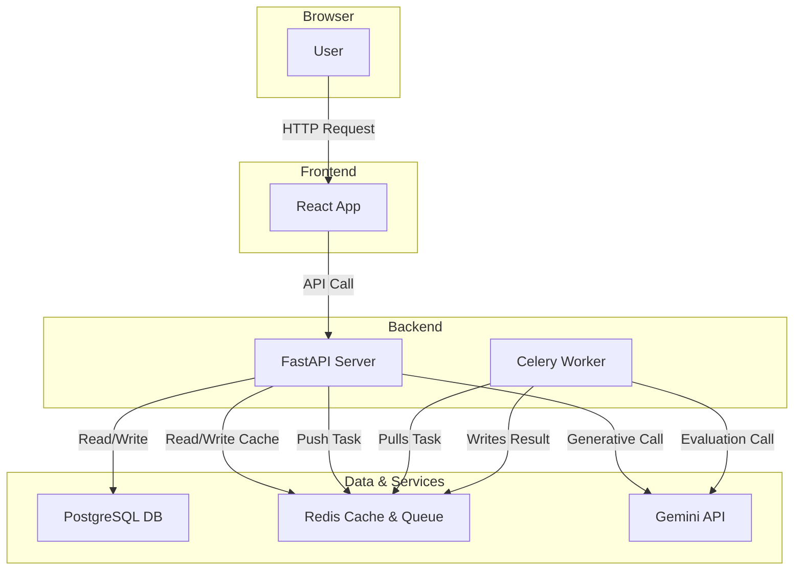

Excellent. Based on a thorough analysis of your project's architecture and function specifications, here is the completed `rag-strategy.md` document.

The key decision is that your project **does not need RAG** because its core functionality is generative and state-driven, not retrieval-based. The document is filled out to reflect this, explaining the alternative approach (Function Calling and structured data) and adapting the evaluation and risk sections accordingly.

---

# RAG Strategy Document

**Team Name:** AI Career Simulation Team
**Project:** CareerSim Platform
**Date:** 2025-11-04

---

## 1. Do We Need RAG?

**Decision:** ☐ YES, we're using RAG | ✅ **NO, we're not using RAG**

**Reasoning:**

Our application's primary function is to **generate novel, creative career simulation scenarios**, not to retrieve factual information from a fixed set of documents. The "knowledge" required is generative capability, which is best accessed through direct calls to a powerful LLM like Gemini.

Our alternative approach relies on a combination of:

1.  **Function Calling:** To trigger specific, stateful actions in our backend (e.g., `generate_career_scenario`, `evaluate_user_response`).
2.  **Structured Database:** PostgreSQL stores user data, session history, and versioned prompt templates, which is more effective than an unstructured vector store for our needs.
3.  **Caching:** Redis is used to cache expensive Gemini API responses, which serves the cost-saving purpose of RAG without the overhead of maintaining a vector index.

---

## 2. Knowledge Sources

Not applicable, as we are not using a traditional RAG approach with a corpus of documents. Our primary "source" of content is the Gemini Pro generative model, guided by prompts stored in our PostgreSQL database.

---

## 3. RAG Architecture Choice

Select ONE architecture:

### ☐ Option A: Traditional RAG (Most Common)

### ☐ Option B: Database RAG

### ☐ Option C: Hybrid RAG

---

### ✅ **Option D: No RAG (Function Calling Only)**

```
User Query → AI Decides → Call Backend Function (e.g., generate_scenario) →
Backend interacts with [Cache, Gemini API, DB] → Return Structured Data →
AI Synthesizes Natural Language → Response
```

**When to use:**

- All data comes from external APIs (not stored by you)
- Real-time data from third-party services
- No document corpus to search

**Our reasoning for choosing this:**
This architecture perfectly matches our project's needs. The core logic is not about "finding" an answer but "creating" an experience.

- **Dynamic Content:** We require unique and plausible scenarios. A static RAG corpus would be repetitive and limit the simulation's replayability.
- **Stateful Interaction:** The simulation flow (generate -> evaluate -> get result) is inherently stateful and transactional, making it a better fit for defined API endpoints and asynchronous tasks (Celery) rather than stateless retrieval.
- **Efficiency:** Building, maintaining, and chunking a document store is unnecessary complexity when our goal is generation. Caching the generated output provides similar performance benefits for repeated requests.

---

## 4. Technical Implementation

Not applicable, as we are not implementing a RAG pipeline (Options A, B, or C). Our technical stack is defined in our main architecture document (FastAPI, PostgreSQL, Redis, Celery, Gemini API).

---

## 5. Citation Strategy

Citations are not applicable to our project.

The content generated (scenarios, feedback) is fictional and created by the AI for the purpose of a simulation. There are no underlying source documents to cite, as we are not performing factual retrieval.

---

## 6. System Performance & Quality Evaluation Plan

While we are not evaluating RAG, we will measure the quality and performance of our generative system.

### Success Metrics

- [ ] **Scenario Quality & Coherence:** Generated scenarios are plausible, engaging, and relevant to the career title.
  - Target: Manual review passes 90% of the time.
- [ ] **Latency:** API response time for key endpoints.
  - Target: `< 300ms` for cached responses, `< 2 seconds` for uncached Gemini calls (p95).
- [ ] **Cost:** Cost per complete user simulation cycle (generate + evaluate).
  - Target: `< $0.01` per cycle on average.
- [ ] **User Satisfaction:** Users rate the simulation experience as helpful and realistic.
  - Target: 4/5 star average rating.

### Test Scenarios

List 5-10 example career titles you'll use to test your system:

1.  Software Developer
2.  UX Designer
3.  Project Manager
4.  Marine Biologist
5.  Corporate Lawyer
6.  Head Chef
7.  Financial Analyst

**For each scenario, what's the expected result?**

- The system should generate a plausible, non-trivial work-related scenario with 3-4 distinct and meaningful decision options. Feedback should be constructive and directly related to the user's choice.

---

## 7. Alternative Approaches (If Not Using RAG)

**This section describes our chosen architecture.**

### How We're Accessing Knowledge/Data Instead

Our system uses two primary mechanisms:

1.  **Direct Generative Calls:** We use function calling to trigger our backend, which makes structured, prompt-engineered calls to the Gemini API. This leverages the LLM's world knowledge and creative capabilities to generate content on-demand.
2.  **Structured Data from PostgreSQL:** We retrieve specific, version-controlled prompt templates from our database to ensure consistent and high-quality generation. User and session data is also managed in the database.

### Why This Is Better for Our Project

- **Flexibility and Creativity:** A generative approach is not limited by a fixed knowledge base, allowing for a virtually infinite variety of scenarios.
- **Cost-Effectiveness:** We avoid the costs of embedding and storing a large corpus. Our caching strategy effectively manages the cost of generation for popular career titles.
- **Reduced Complexity:** The architecture is simpler and more direct for our use case. Adding a vector database and retrieval pipeline would be an unnecessary layer of abstraction and maintenance.

---

## 8. Implementation Timeline

- **Week 6:** Implement Core Backend (Pydantic, JWT, Rate Limiting) & Docker setup.
- **Week 7:** Integrate Gemini API for scenario generation and implement Celery for asynchronous evaluations.
- **Week 8:** Implement Redis caching layer and set up the initial CI/CD pipeline.
- **Week 9:** Develop graceful fallback systems for the Gemini API and externalize prompts into the PostgreSQL database.
- **Week 10:** Focus on performance tuning, implementing structured logging (structlog), and comprehensive testing.

---

## 9. Risks and Mitigations

### Risk 1: Poor Generation Quality

**Symptom:** Scenarios are nonsensical, repetitive, or irrelevant to the career title.

**Mitigation:**

- [✅] Implement prompt versioning in the database to iterate and improve prompts without redeploying.
- [✅] Use a faster, cheaper model (Gemini Flash) for initial drafts and a more powerful model (Gemini Pro) for refinement if needed.
- [✅] Implement a fallback system with pre-written "golden" scenarios for common careers if the API fails.

### Risk 2: High Latency

**Symptom:** Scenario generation or evaluation takes >3 seconds.

**Mitigation:**

- [✅] Use Celery to run long evaluations as background tasks, providing the user with an immediate "pending" response.
- [✅] Aggressively cache generated scenarios and evaluations in Redis to serve repeat requests instantly.
- [✅] Use the fastest available model that meets quality requirements (e.g., Gemini Flash).

### Risk 3: High Costs

**Symptom:** Gemini API costs exceed budget due to repeated or inefficient calls.

**Mitigation:**

- [✅] Implement strict API rate limiting per user/IP.
- [✅] Use Redis caching to drastically reduce API calls for the same inputs.
- [✅] Monitor API usage closely and optimize prompts to be more token-efficient.

### Risk 4: Unsafe or Biased Content Generation

**Symptom:** LLM generates inappropriate, offensive, or biased scenarios/feedback.

**Mitigation:**

- [✅] Implement strict system prompts that define the AI's role and constraints (e.g., "You are a helpful and professional career simulator. Do not generate harmful content.").
- [✅] Use built-in safety features from the model provider (e.g., Google's safety settings).
- [✅] Add an extra validation layer in the backend to scan for keywords or patterns before sending content to the user.

---

## 10. Resources and References

**Tutorials/Guides We're Following:**

- FastAPI Official Documentation
- Celery Project Documentation
- Google AI for Developers (Gemini API Docs)

**Libraries/Tools We're Using:**

- FastAPI, Pydantic, SQLAlchemy, Alembic
- Celery, Redis (redis-py)
- Google Generative AI SDK
- Docker, GitHub Actions

**Team Members Responsible:**

- Backend & API Logic: [Name]
- Prompt Engineering & Gemini Integration: [Name]
- DevOps (Docker, CI/CD): [Name]

---

## Appendix: RAG Architecture Diagram

Our architecture does not use RAG. The following diagram shows our actual data flow.



---

## Sign-off

**Team Members:**

- Toma Danelia , Sopo Mrelashvili - Lead Backend Developers
- Temuri Matchavariani - Frontend & State Management
- Davit Ioramashvili- DevOps & Data Layer
  **Date Completed:** 2025-11-04

**Reviewed By Instructor:** [ ] Yes [ ] No [Date: _____ ]
